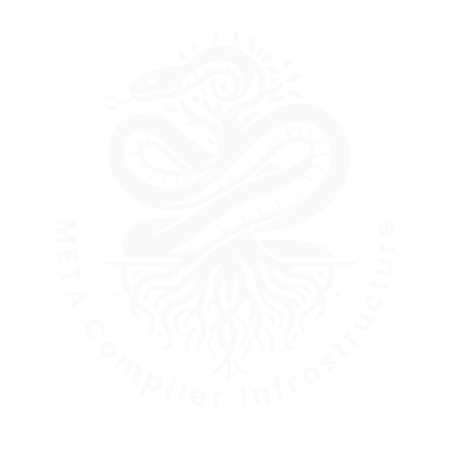

[![Contributors][contributors-shield]][contributors-url]
[![Forks][forks-shield]][forks-url]
[![Stargazers][stars-shield]][stars-url]
[![Issues][issues-shield]][issues-url]
[![MIT License][license-shield]][license-url]

<br />
<div align="center">
  <a href="https://meta-lang.com">
    
  </a>

<h3 align="center">META</h3>

  <p align="center">
    <a href="https://meta-lang.com/docs"><strong>Explore the docs »</strong></a>
    <br />
    <br />
    <a href="https://github.com/the-meta-lang/meta/issues">Report Bug</a>
    ·
    <a href="https://github.com/the-meta-lang/meta/issues">Request Feature</a>
  </p>
</div>

- [About The Project](#about-the-project)
- [Getting Started](#getting-started)
- [Contributing](#contributing)
- [License](#license)


<!-- ABOUT THE PROJECT -->
## About The Project
META is a compiler writing language inspired by the META-II Metacompiler from the seminal paper "[META II a syntax-oriented compiler writing language](https://dl.acm.org/doi/10.1145/800257.808896)" written by Val Schorre in 1963. META allows for the creation of compilers, parsers and interpreters for programming languages using a concise and powerful syntax.


## Getting Started

META comes as a standalone binary. You may also compile it for your specific system but as of yet, it has only been tested on Linux x86_64 and the used syscalls **WILL NOT WORK on Windows**.

The binary takes a single positional argument, a path to a source `.meta` file containing the syntax definition for your language.

```sh
./bootstrap/meta.bin <source>
```

Replace `<source>` with the actual filename of your META program source file. The bootstrap compiler will then generate a compiler for your program.

Congratulations! You've just written your first compiler!

If you want to further develop a compiler using hot reloading, you can use the `cascade.bash` file. This script will watch for changes in any of the supplied files and compile/execute them in order they were passed in. You might use it like this:

```sh
bash cascade.bash <root-compiler> <application-compiler> <input>
```

The output will be printed to the console.

_For more examples, please refer to the [Documentation](https://meta-lang.com/docs)_

## Contributing

Contributions are what make the open source community such an amazing place to learn, inspire, and create. Any contributions you make are **greatly appreciated**.

If you have a suggestion that would make this better, please fork the repo and create a pull request. You can also simply open an issue with the tag "enhancement".
Don't forget to give the project a star! Thanks again!

1. Fork the Project
2. Create your Feature Branch (`git checkout -b feature/AmazingFeature`)
3. Commit your Changes (`git commit -m 'Add some AmazingFeature'`)
4. Push to the Branch (`git push origin feature/AmazingFeature`)
5. Open a Pull Request

## License

Distributed under the MIT License. See `LICENSE` for more information.


[contributors-shield]: https://img.shields.io/github/contributors/the-meta-lang/meta.svg?style=for-the-badge
[contributors-url]: https://github.com/the-meta-lang/meta/graphs/contributors
[forks-shield]: https://img.shields.io/github/forks/the-meta-lang/meta.svg?style=for-the-badge
[forks-url]: https://github.com/the-meta-lang/meta/network/members
[stars-shield]: https://img.shields.io/github/stars/the-meta-lang/meta.svg?style=for-the-badge
[stars-url]: https://github.com/the-meta-lang/meta/stargazers
[issues-shield]: https://img.shields.io/github/issues/the-meta-lang/meta.svg?style=for-the-badge
[issues-url]: https://github.com/the-meta-lang/meta/issues
[license-shield]: https://img.shields.io/github/license/the-meta-lang/meta.svg?style=for-the-badge
[license-url]: https://github.com/the-meta-lang/meta/blob/master/LICENSE.txt